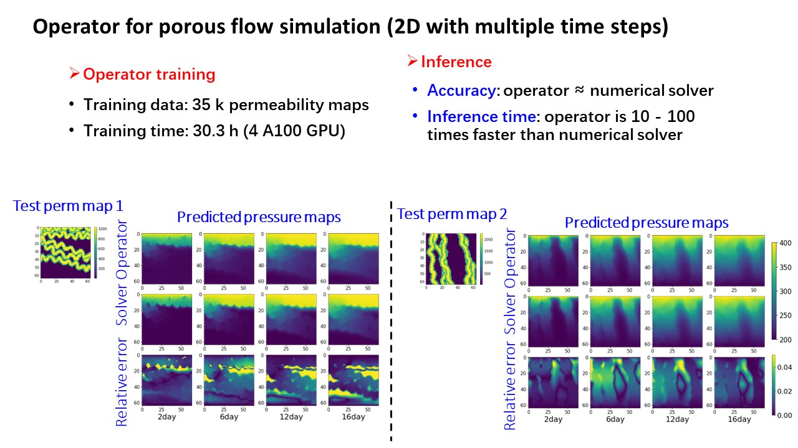

## Physics-informed multi-grid neural operator: theory and an application to porous flow simulation

 
**Picture:** *Prediction of pressure maps after different time steps of water flowing in a 2D channlized porous media*

This repository contains the official TensorFlow implementation of the following paper:

> **Physics-informed multi-grid neural operator: theory and an application to porous flow simulation** 
> Suihong Song (Stanford University), Tapan Mukerji (Stanford University), Dongxiao Zhang (Eastern Institute of Technology, Ningbo, China)  

> Available at my researchgate profile https://www.researchgate.net/profile/Suihong_Song
> 
> **Abstract:** We propose a physics-informed multi-grid finite neural operator as an efficient alternative for PDE solvers. The operator aims to map a random parameter function to the corresponding solution function of a linear PDE, both distributed on a fine grid (called original grid). The training of the operator involves using the physics-informed method to train a neural network on the original grid to approximate the PDE solution. The grid is then coarsened, and a new neural network is trained on the coarse grid to approximate the prediction error of the previous network. This process is iteratively repeated until the final grid's neural network achieves adequate accuracy. The combination of all neural networks from coarse to fine grids forms the multi-grid neural operator capable of mapping random parameters to solutions on the original grid. The above process involving fine-coarse-fine grid is called one V cycle (following the traditional multi-grid PDE literature), and multiple V cycles can be included into the operator to enhance its performance. Additionally, the operator integrates the idea of using coarse-grid predictions as initial guesses for fine-grid predictions. Validation is performed using three porous flow examples of varying dimensions. The operator's prediction accuracy improves with more V cycles included, and its predictions closely match results obtained from a numerical solver while executing 10 to 100 times faster. 

**Brief ppt slides for a conference talk about this work is open accessed: [ppt](./AGU2023Talk_MultigridNeuralOperator.pptx)**

For any question, please contact [suihong@stanford.edu] or [songsuihong@126.com] 

## This repository contains code notebooks, training/test dataset, and pretrained neural operator models of the three cases in the aforementioned paper:

### ([1D flow case](./1DFlow/)):

- [CodeNotebooks](./1DFlow/CodeNotebooks/): two notebooks (using python and tensorflow 2.x) for 1D porous flow using neural operators with and without multi-grid techniques.
- [TestDataset](./1DFlow/TestDataset/): test permeability and pressure curves

### ([2D flow with single time step case](./2DFlow_SingTime/)):

- [CodeNotebooks](./2DFlow_SingTime/CodeNotebooks/): one notebook (using python and tensorflow 2.x) for 2D porous flow with single time step using multi-grid neural operator.
- [Dataset](./2DFlow_SingTime/Dataset/): (1) [2D channelized facies models](./2DFlow_SingTime/Dataset/2D_AllPro_Gslib_fromPetrel(version4).7z), (2) [test permeability maps and boundary pressures](./2DFlow_SingTime/Dataset/PremMaps_BoundPres_64x64/), (3) [test pressure maps](./2DFlow_SingTime/Dataset/SimulatedPressureMaps_400_200_30daysInterval_64x64/)
- [Pre-trained neural operator model](./2DFlow_SingTime/TrainedOperatorModel): as neural networks of different grids in each V cycle.

### ([2D flow with multiple time step case](./2DFlow_MultiTime/)):

- [CodeNotebooks](./2DFlow_MultiTime/CodeNotebooks/): one notebook (using python and tensorflow 2.x) for 2D porous flow with multiple time steps using multi-grid neural operator.
- [Dataset](./2DFlow_MultiTime/Dataset/): [2D channelized facies models](./2DFlow_SingTime/Dataset/2D_AllPro_Gslib_fromPetrel(version4).7z) and [test permeability maps and boundary pressures](./2DFlow_SingTime/Dataset/PremMaps_BoundPres_64x64/) are the same as in the previous 2D single time case; [test pressure maps](./2DFlow_MultiTime/Dataset/SimulatedPressureMaps_400_200_1to16days_1dayInterval_64x64/).
- [Pre-trained neural operator model](./2DFlow_MultiTime/TrainedOperatorModel): as neural networks of different grids in each V cycle.

